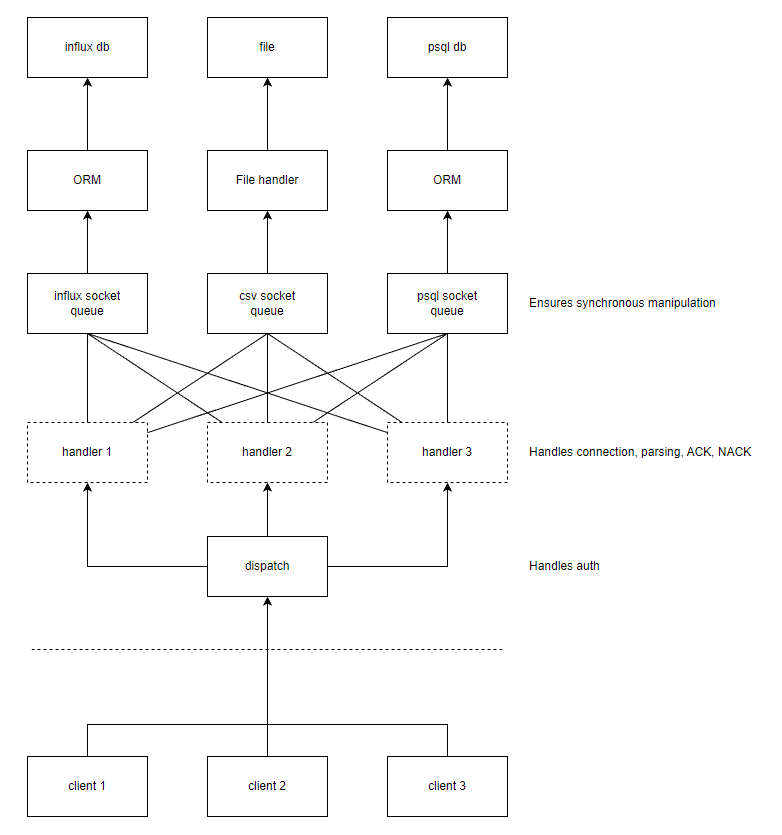

# rLog

Many-to-many logging system

### Dispatch
Dispatch instantiates handler child processes
each implementing queue of received log requests from a single client.

### Handler
Handler subprocesses are instantiated 1 on 1 to client socket connection.

### Parsing
Both generator and receiver objects must implement same parsing logic.
Messages are transported in JSON format.

### Messages
Data is transmitted in serialized JSON format as:

    {
        "auth": "secret",
        "type": "<type>"
        "timestamp": <int>
        "payload": {
            "temperature": 12,
            "humidity": 75
        }
    }
    
    Where "type" is a list in which each item corresponds to Handler name